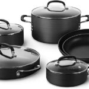
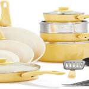
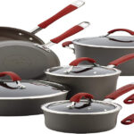
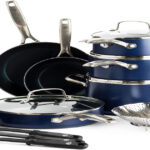
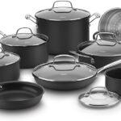

Some cookware sets cost **[more than $500](https://thekitchenpot.com/blog/all-clad-d3-cookware-set-review//)**. If you’re lucky, you might be able to afford one of these top-of-the-line sets for yourself.

But if you have a limited budget, spending several hundred to a thousand dollars on pots and pans may not be within your reach. So, what can you do?

Don’t worry.

This article will list the best **[cookware set under $200](https://www.amazon.com/s?k=cookware+sets&rh=n%3A1055398%2Cp_n_price%3A1253526011&crid=2MSXSCH9QZ5J7&nav_sdd=aps&rnid=386465011&sprefix=cookware+sets&?tag=kitchenpot-20)**. We offer first-hand experiences and reliable reviews of the products we’ve included on our list.

We also offer tips on how to choose pots and pans according to your needs and preferences. As you will see, there are a lot of good cookware sets out there that won’t cost you an arm or leg. You won’t have to sacrifice quality just because you don’t want to break the bank. 

## Best Pots and Pans Set Under $200 Comparison Table

Cookware Under $200

Image

Features

Price

Ninja Foodi NeverStick Premium Hard-Anodized 8-Piece Cookware Set

\-Hard-anodized exterior, oven-safe up to 500 degrees F, neverstick surface

[Check Price](https://www.amazon.com/Ninja-C38000-NeverStick-Hard-Anodized-Cookware/dp/B08C1FFSBD/?tag=kitchenpot-20)

Calphalon Simply Pots and Pans set

\-Hard-anodized aluminum cookware, 2-layer nonstick interior, silicone handles

[Check Price](https://www.amazon.com/Simply-Calphalon-Nonstick-Cookware-SA10H/dp/B001AS94TY/?tag=kitchenpot-20)

GreenLife Soft Grip Healthy Ceramic Nonstick Yellow Cookware Pots and Pans Set, 16-Piece

\-Aluminum with ceramic coating, glass lids, stay cool handles

[Check Price](https://www.amazon.com/GreenLife-Healthy-Nonstick-Cookware-16-Piece/dp/B08CY4VVWH/?tag=kitchenpot-20)

Rachael Ray Cucina Hard-Anodized Nonstick Cookware Pots and Pans Set

\-Oven safe to 400 degrees F, Dual riveted handles and shatter resistant glass lids, dishwasher safe

[Check Price](https://www.amazon.com/Rachael-Ray-Hard-Anodized-Aluminum-Cranberry/dp/B00J9FFP98/?tag=kitchenpot-20)

Blue Diamond Cookware Diamond-Infused Ceramic Nonstick, Cookware Pots, and Pans Set, 14 Piece

\-Diamond-infused ceramic cookware, elegantly finished, Oven and broiler safe up to 600°F

[Check Price](https://www.amazon.com/Blue-Diamond-Pan-CC001951-001-Cookware-Set/dp/B07HMGZSHJ/?tag=kitchenpot-20)

Cuisinart 14 Piece Chef's Classic Non-Stick Hard Anodized Cookware Set

\-Hard anodized exterior, Quantanium nonstick interior, Oven safe to 500 degree F

[Check Price](https://www.amazon.com/Cuisinart-66-14N-Non-Stick-Anodized-Cookware/dp/B01IO776JS/?tag=kitchenpot-20)

.wpdt-fs-000016 { font-size: 16px !important;} .wpdt-ff-000001 { font-family: Georgia, serif !important;}

## 10 **Best Cookware Set Under $200 Reviews** 

### **1\. [Ninja Foodi NeverStick Premium Hard-Anodized 8-Piece Cookware Set](https://www.amazon.com/Ninja-C38000-NeverStick-Hard-Anodized-Cookware/dp/B08C1FFSBD/?tag=kitchenpot-20)**

The Ninja Foodi NeverStick Premium Hard-Anodized 8-Piece Cookware Set will never stick, chip or flake and is oven safe up to 500°F. It is easily the best nonstick cookware set under $200.

Its premium stainless steel handles are designed with comfort in mind. Even better, it is double riveted for durability and great balance, making you feel smooth as silk while cooking. This eco-friendly set boasts PFOA, cadmium, and lead-free manufacturing.

It is made out of a 4.5 mm aluminum base that ensures even heating for consistent results. Its durable nonstick material is easy to clean and maintain. Additionally, its exterior hard-anodized aluminum is heated to temperatures of over 30,000°F (during manufacturing), thus ensuring that your pots do not lose their nonstick property rapidly. 

We strongly recommend that you preheat your pots before you start cooking. Failure to do this will lead to sticking.

Additionally, we found these pots and pans taking too much time to preheat. This is largely due to their heavy nature. However, the wait will pay off as it will be highly forgiving throughout your cooking escapades.

**[Check Our First-Hand Ninja Neverstick Premium Review Here](https://thekitchenpot.com/blog/ninja-foodi-cookware-set-reviews//)**

This set includes an 8-inch fry pan, 10 1/4 inch fry pan, 2 1/2 quart saucepan with glass lid; 3 quarts sauté pan with glass lid, and the 6 1/2 quart stockpot with a tempered glass cover. Some of the pans share one lid because that guarantees versatility.

You’ll also like the fact that all its glass lids come with a 13-mm thick stainless steel rim to prevent splattering and lock in moisture. It doesn’t require butter, oil, or shaking out pre-cooking residue!

[Check Price on Amazon](https://www.amazon.com/Ninja-C38000-NeverStick-Hard-Anodized-Cookware/dp/B08C1FFSBD/?tag=kitchenpot-20)

### **2\. [Calphalon Simply Pots and Pans Set, 10 Piece Cookware Set, Nonstick](https://www.amazon.com/Simply-Calphalon-Nonstick-Cookware-SA10H/dp/B001AS94TY/?tag=kitchenpot-20)**

Calphalon Simply Pots and Pans set is your ideal cookware if you value class and you’re on a budget. Included in the set is every cookware you’ll need to create tasty meals for your whole family.

The pieces are oven safe up to 400 degrees F. As such, they’re perfect for serving food at holidays or hosting parties!. The hard-anodized aluminum cookware resists corrosion and warping while the durable 2-layer nonstick prevents food from sticking to it for fast cleanup.

The long silicone handles stay cool on the stovetop, even with repeated use that maybe have turned things a little bit overheated in the kitchen. And if that isn’t enough, these pots and pans come with tempered glass lids covering them so all of your sauces won’t dry out.

Even better, and a sign of assurance, these pots come with a 10-year warranty!

[Check Price on Amazon](https://www.amazon.com/Simply-Calphalon-Nonstick-Cookware-SA10H/dp/B001AS94TY/?tag=kitchenpot-20)

### **[3\. GreenLife Soft Grip Healthy Ceramic Nonstick Yellow Cookware Pots and Pans Set, 16-Piece](https://www.amazon.com/GreenLife-Healthy-Nonstick-Cookware-16-Piece/dp/B08CY4VVWH/?tag=kitchenpot-20)**

This GreenLife Soft Grip Healthy Ceramic Nonstick Yellow Cookware Set is ideal for a variety of dishes – from beloved staples to healthier specials. The ceramic nonstick coating is derived from sand and free of PFAS, PFOA, lead, and cadmium.

As such, you can be sure that they are safer to cook with. Its bakelite handles are designed to stay cool on the stovetop so you can go without bulky oven mittens when cooking!

Made from recycled aluminum supremely strengthened by a wobble-free base, this set ensures even heating that’ll never prematurely dry out your beef stew or melt your blueberry cobbler crusts. Which makes cleanup a breeze!

Durable and easy to clean coatings help foster a satisfying cooking experience by replicating traditional stainless steel without all those nasty reactive metals—so you’ll have no regrets!

The cookware set includes 1-quart & 2-quart saucepans with lid, 4 inches mini frying pan,2.5-quart saute pan with lid, 7-inch & 9.5-inch frying pans, 7-inch stainless steel steamer, and 4 kitchen utensils.

[Check Price on Amazon](https://www.amazon.com/GreenLife-Healthy-Nonstick-Cookware-16-Piece/dp/B08CY4VVWH/?tag=kitchenpot-20)

### 4\. **[Rachael Ray Cucina Hard-Anodized Nonstick Cookware Pots and Pans Set](https://www.amazon.com/Rachael-Ray-Hard-Anodized-Aluminum-Cranberry/dp/B00J9FFP98/?tag=kitchenpot-20)**

This hard anodized cookware set is both elegant and durable to last for years, quickly heating food without sticking. The pans are coated in a kitchen favorite- nonstick coating. You’ll never need to use oil either!

This set lives up to high standards of durability, quick heating, oven safety, good food release, dishwasher safe design, and more. The red insulated glass lids come in handy if you need to check what’s cooking without letting off moisture and nutrients.

**[Read our review on Rachael Ray Cookware](https://thekitchenpot.com/blog/rachael-ray-cookware-reviews//)**

Additionally, the sturdy cookware is oven safe up to 400° F, ensuring that no harmful chemicals can leach into food or household surfaces. They feature dual riveted handles – heavy-duty yet comfortable enough for you to pick up with one hand.

If stirring stock doesn’t interest you, the glass lid’s built-in vent hole will allow steam release so your meal won’t boil over! The interior is coated in durable stainless steel nonstick for easy cleaning. It is also dishwasher-safe!

[Check Price on Amazon](https://www.amazon.com/Rachael-Ray-Hard-Anodized-Aluminum-Cranberry/dp/B00J9FFP98/?tag=kitchenpot-20)

### [5\. **Blue Diamond Cookware Diamond-Infused Ceramic Nonstick, Cookware Pots, and Pans Set, 14 Piece**](https://www.amazon.com/Blue-Diamond-Pan-CC001951-001-Cookware-Set/dp/B07HMGZSHJ/?tag=kitchenpot-20)

Blue Diamond Cookware is shimmering and exotic. The pot lids close with a satisfyingly tight seal, and the handles are easy to grip.

When you lift each piece from the oven or broiler, your hands won’t recoil from sudden heat as you lower those beautiful pots into their rightful places on your stovetop. All of this comes with a warming color scheme for a kitchen that radiates class and style!

Cookware set includes 7″ and 9.5″ frying pans, 2.5 quarts sauté pan with lid, 2 quart and 3-quart saucepans with lids, 5-quart stockpot with lid, 3 multipurpose black nylon cooking utensils, and 1 stainless steel steamer. It is the perfect cookware for anyone starting or who is feeling constrained by the need to only buy kitchen tools on a budget!

**Do Not Buy this Cookware Set if you exclusively use induction cooktop. It won’t work!**

**[Read our first-hand review on Blue Diamond Cookware Here](https://thekitchenpot.com/blog/blue-diamond-cookware-review//)**

Blue Diamond’s signature diamond-infused ceramic nonstick is 5x harder and 10x longer lasting than traditional coatings. Keep in mind that diamonds are 4x more conductive than copper, so it heats up faster. Even better, they are free of lead, cadmium, PFOA, and PFAs.

With Dutch ovens and roasters among the most versatile pots in the kitchen, these sauté pans will make melting chocolate, whisking sauces, searing steaks, or wrapping meatloaf with bread crumbs effortless.

[Check Price on Amazon](https://www.amazon.com/Blue-Diamond-Pan-CC001951-001-Cookware-Set/dp/B07HMGZSHJ/?tag=kitchenpot-20)

### **[6\. Cuisinart 14 Piece Chef’s Classic Non-Stick Hard Anodized Cookware Set](https://www.amazon.com/Cuisinart-66-14N-Non-Stick-Anodized-Cookware/dp/B01IO776JS/?tag=kitchenpot-20)**

The Cuisinart 14-Piece Chef’s Classic Non-Stick Hard Anodized Cookware Set is perfect. The hard-anodized exterior provides extra durability and the quantanium nonstick interior makes cleanup and meal preparation a breeze.

This set includes just about any pan you’ll ever need in your kitchen, plus oven-safe glass lids that allow you to watch your food while it cooks thanks to break-resistant covers with tapered rims for spill-free pouring.

You can cook in the oven, at temperatures of up to 500 degrees Fahrenheit. No cooking oils or butter is needed; simply use the recipe as written.

If you want to make your dish for fewer people, just halve the recipe and cook in smaller pans – it’s that easy! This set includes frypans, saucepans, a wok pan, and all of your essential pots and pans to make every day simple yet fabulous.

[Check Price on Amazon](https://www.amazon.com/Cuisinart-66-14N-Non-Stick-Anodized-Cookware/dp/B01IO776JS/?tag=kitchenpot-20)

### **[7\. T-Fal Signature Nonstick Dishwasher Safe Cookware Set, 12-Piece](https://www.amazon.com/T-fal-Signature-Dishwasher-Thermo-Spot-Indicator/dp/B001167VIQ/?tag=kitchenpot-20)**

Give your food golden-brown seared crusts and moist, tender meat with the T-Fal Signature Nonstick Dishwasher Safe Cookware Set. With a large range of pots and pans, you can prepare all the dishes you know and love with this set!

The set comes with 7.75 inch and 11-inch fry pans; 1 quart and 2-quart saucepans; 5.5-quart Dutch oven (with lid); and 10.25 inch griddle—all giving an ergonomic heat resistant handle for comfortable grip. Additionally, all these pans are oven-safe up to 350 Fahrenheit temperature.

**This cookware set is not ideal for induction cooktops.**

However, a little seasoning before cooking is needed. It gives the nonstick coating a protective coat that prevents food from sticking.

[Check Price on Amazon](https://www.amazon.com/T-fal-Signature-Dishwasher-Thermo-Spot-Indicator/dp/B001167VIQ/?tag=kitchenpot-20)

### 8\. **[GRANITESTONE Stackmaster 15 Piece Nonstick Cookware Set](https://www.amazon.com/GRANITESTONE-Induction-compatible-Scratch-Resistant-Granite-coated-Dishwasher-Safe/dp/B0816ZPCJ6/?tag=kitchenpot-20)**

The Granitestone Stackmaster Cookware Set is the ultimate functional and beautiful cookware for your family. This piece is marvelously designed with a nonstock outer coating for ease of cleaning.

Its triple-coating ensures that you won’t have to worry about scratches or warping while it’s in use. Additionally, its PFOA-free construction ensures that always feel confident when cooking without fretting over toxin leaches.

Induction compatibility also creates a versatile product that will meet all your needs by working across many surfaces including gas stovetops as well as electric ranges.

What’s most important is its **[space-saving nature!](https://thekitchenpot.com/blog/7-best-stackable-pots-and-pans//)** The stacking system ensures that you can save on space while also taking up less room in your cabinet.

It includes a 3.5-quart saucepan with lid, 8.5 inches frying pan, 10 inches fry pan with lid, 2.75-quart saucepan with lid, 3.5-quart fry basket, and 5.35-quart stockpot with lid.

[Check Price on Amazon](https://www.amazon.com/GRANITESTONE-Induction-compatible-Scratch-Resistant-Granite-coated-Dishwasher-Safe/dp/B0816ZPCJ6/?tag=kitchenpot-20)

### **[9\. Gotham Steel 20 Piece Pots & Pans Set Complete Kitchen Cookware + Bakeware Set](https://www.amazon.com/20-Piece-Pots-Pans-Set/dp/B076B5BQ78/?tag=kitchenpot-20)**

Gotham Steel pots and pans are made out of top-of-the-line materials that make them durable and great for cooking.

Its high-quality steel and Ti-Cerama coating construction ensure that your pans release foods without sticking, so there’s no need to use butter or oil. It will also be a breeze to clean them. They are oven-safe up to 500° F!

Additionally, the 20-piece come with stay-cool handles so they won’t get too hot while you’re cooking or waiting on dinner to be ready. All **[Gotham Steel products](https://thekitchenpot.com/blog/gotham-steel-smokeless-grill-review//)** are free of toxins.

Not only is the pot visually stunning but it also features innovative design, colorfast workmanship, and is even safe for healthy cooking. The cooks set from Gotham Steel includes all cookware essentials from skillets to saucepans as well as bakeware that will complete your kitchen stock!

### From professional chefs looking for a new cookware companion to busy moms, these pots are a delight.

[Check Price on Amazon](https://www.amazon.com/20-Piece-Pots-Pans-Set/dp/B076B5BQ78/?tag=kitchenpot-20)

### **[10\. Kitchen Academy Induction Kitchen Cookware Sets Nonstick – Set 12 Piece](https://www.amazon.com/Induction-Kitchen-Cookware-Sets-Nonstick/dp/B08W547JH2/?tag=kitchenpot-20)**

What can you do in a Kitchen Academy Induction Cookware Set? With a set of 12 pieces, you’ll be able to cook anything from searing meat and braising to frying rice.

The aluminum core heats up quickly and distributes the heat evenly—so your food will always get the thorough cooking it needs without burning or overcooking.

To clean, just add water and dish acid cleaner for easy cleaning. Remember that the graniteware coating resists sticking, so your Food won’t turn into an utter mess when you take it out! You don’t have time for this hassle!

The set includes 8″ fry pans, (2) 9 1/2″ fry pans with a lid, 5-quart casserole with lid, 1.5-quart saucepan with lid, 3-quart casserole with lid, and nylon utensils (2 pieces).

[Check Price on Amazon](https://www.amazon.com/Induction-Kitchen-Cookware-Sets-Nonstick/dp/B08W547JH2/?tag=kitchenpot-20)

## **Best Cookware Set Under $200 – Buying Guide**

There are a lot of best cookware set under 200, but which one should you choose? Well, it all boils down to what you need. If you want something practical, a [stainless steel](https://en.wikipedia.org/wiki/Stainless_steel) set is a good choice. They can withstand a lot of heat and won’t break upon impact!

If you’re going for the nonstick type, important factors to consider include ease of use, food release abilities, and chemical-free coatings.

It’s also wise to get cookware sets that are easy to clean and will not give you any problems with the cheese, egg yolk, or tomato sauce sticking to it.

Several cookware sets allow for heat adjustment depending on the type of cooking you’re doing—such as with induction stoves or at low-heat settings.

And, don’t forget about heat distribution. Go for one that distributes heat evenly, whether it’s through a copper core, aluminum, or even IH (induction heating) technology.

If you use an induction cooktop, you should particularly be careful. Not all cookware sets will work well with your induction hob. We recommend that you read our guide on the **[best cookware for induction cooktops](https://thekitchenpot.com/blog/best-cookware-for-induction-cooktop//)** before you settle for one.

## Other Factors to Consider When Shopping for a Cookware Set

**Price**

Most cookware sets in the market will fall within a specific price range, which you can check by going through the different **[options on Amazon](https://www.amazon.com/s?k=cookware+sets&rh=n%3A1055398%2Cp_n_price%3A1253526011&crid=2MSXSCH9QZ5J7&nav_sdd=aps&rnid=386465011&sprefix=cookware+sets&?tag=kitchenpot-20)**. Cheap sets typically have an aluminum or stainless steel construction with no nonstick coating. They might be great to use for beginners, but they don’t last so long!

Mid-range sets might provide a better value for your money, as they typically have a nonstick coating. Most of them cost below between **[$100 and $200](https://www.amazon.com/s?k=cookware+sets&rh=n%3A1055398%2Cp_n_price%3A1253526011&crid=2MSXSCH9QZ5J7&nav_sdd=aps&rnid=386465011&sprefix=cookware+sets&?tag=kitchenpot-20)**. They are decent sets that will serve you for long. With this range, you can invest your money without a worry of compromising on quality. You’ll get very good sets here as we’ve detailed in the list of best affordable cookware sets.

And lastly, if you want something worth the price tag, go for the high-end cookware set! But remember that high-end cookware sets won’t be cheap at all—they would cost hundreds of dollars. You’ll need to decide if it’s worth buying or not!

**Heat Distribution**

Cookware sets with even heat distribution ensure that the food will be cooked thoroughly and evenly. They’re usually made from stainless steel, carbon steel, or copper, which is what makes them pricier than your average cookware set.

However, there is an adoption of technology to integrate features of different metals into one cookware. For example, the use of **[cladded construction by All-Clad](https://thekitchenpot.com/blog/all-clad-d3-vs-d5//)** ensures that you get the benefits of aluminum and steel.

Good heat distribution also means that heat is evenly transferred to the food, leading to easy cooking and hassle-free cleaning. Choose a pan that has an aluminum, copper, cast iron, or carbon steel base for guaranteed efficacy.

**Stability**

This factor also goes hand in hand with heat distribution. Reliable cookware sets come in rubberized handles so they won’t get loose and fall off.

This ensures that you’ll be able to hold on: while cooking and cleaning. Additionally, durable construction should be one that is rust-resistant, warping-resistant, and scratch resistant.

**Durability**

For something that’s going to last you a long time, make sure it’s also made from high-quality stainless steel (not aluminum) to endure stains and other elements. If it has to be aluminum, ensures that its hard-anodized. This type of aluminum is hardened and will last for long!

This design makes for easy cleanup and saves you from the hassle of scrubbing your cookware set time after time!

## **Best Cookware Set Under $200 – Bottom Line**

It’s never easy shopping for cookware sets because there are just so many options out there. With the different factors to consider, it might be overwhelming at first.

The good thing, though, is that you can take your time browsing through all the options until you find that one perfect set for your kitchen!

Just remember to refer to our article on the top 10 cookware sets under $200, and you’re good to go!

Hope you find our article helpful. Do not forget to drop your comments below to share your tips! If you think we missed something or would like us to consider other options, feel free to contact us. Thanks!