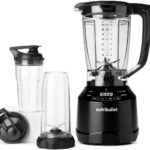
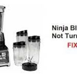
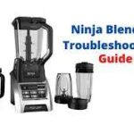

NutriBullet vs Ninja Blender question is frequent among [smoothie](https://www.goodhousekeeping.com/food-recipes/healthy/g4060/healthy-smoothie-recipes/) lovers. And for a good reason. The two companies have a significantly large share of the blender/juicer industry.

As such, it can be confusing to choose the best blender for smoothies from the two most popular blenders: [NutriBullet](https://www.amazon.com/s?k=nutribullet+blender&rh=n%3A1055398%2Cp_89%3ANutriBullet&dc&qid=1635088577&rnid=2528832011?tag=kitchenpot-20) and [Ninja](https://www.amazon.com/s?k=Ninja+Blenders&rh=n%3A1055398%2Cp_89%3ANinja&dc&qid=1635088638&rnid=2528832011&?tag=kitchenpot-20).

So, what is the difference between the two blenders? This article provides in-depth NutriBullet vs. Ninja Blender reviews to ensure that you make an informed buying decision. Read on.

## Ninja Blender Vs NutriBullet – Why You Need One

While fruits contain critical nutrients, we find it difficult to eat the [recommended amount](https://www.myplate.gov/eat-healthy/fruits). This is largely due to our busy life schedules, making it hard to find time to eat hard fruits.

However, eating fruits is not optional!

They provide crucial nutrients that are essential for your well-being. As such, you must find a way to circumvent the time limitation. One proven technique is juicing fruits and vegetables.

To achieve juicing, we recommend that you invest in a [reliable blender](https://thekitchenpot.com/blog/best-blenders-for-smoothies//) or a [juicer](https://thekitchenpot.com/blog/best-commercial-masticating-juicer//). This way, you’ll easily blend enough fruits and vegetables, and take them in the form of juice.

## NutriBullet Blender vs. Ninja Blender – Overview 

NutriBullet and Ninja make pretty decent [blenders](https://thekitchenpot.com/blog/best-blender-for-protein-shakes//). We set out to test a few of the two brands and rate them based on their efficiency and reliability on various tasks. Here is a summary of our findings:

Feature

Ninja Blender

NutriBullet Blender

**Size**

Mostly big countertop options with big pitchers (72 oz)

Mostly personal blenders with small cups. Large Nutribullet blender has a pitcher with 64 oz capacity

**Use**

Ideal for food prep and preparing smoothies for many people. Has six removable blades

Ideal for travelling and preparing drinks for one person (with the exception of **[NutriBullet Combo Blender](https://www.amazon.com/NutriBullet-Blender-Combo-Single-Serve/dp/B09FH53Y8H?tag=kitchenpot-20))**

**Controls**

Complex controls with many options for guaranteed diversity.

Primarily comes with two buttons. Easy to use

**Reliability**

Very Reliable

Averagely reliable (we found Ninja to be better in strength and overall productivity)

**Design**

Large and countertop models

Compact

**Portability**

Relatively bulky and different to carry

Lightweight and easy to carry around.

**Noise Level**

Quieter than Nutribullet

Relatively Noisy

NutriBullet blenders are generally smaller than Ninja Blenders. They were primarily designed for making personal drinks. As such, most of them have small pitchers. Nevertheless, [**Nutribullet made a blender combo**](https://www.amazon.com/NutriBullet-NBF50520-Touch-Combo-Blender/dp/B08SF5SL9V?tag=kitchenpot-20) with a relatively large pitcher.

If you are looking for a versatile blender, then we recommend that you buy any of the following:

-   Ninja Mega Kitchen System (BL770) Blender/Food Processor
-   NutriBullet NBF50520 Touch Combo Blender

However, we rate Ninja Blenders better than the Nutribullet touch combo. It outperforms the Nutribullet in various facets, including the strength of the motor, easy controls, and versatility of the pitchers.

### **[Ninja Mega Kitchen System (BL770) Blender/Food Processor](https://www.amazon.com/Ninja-Kitchen-BL770-Processor-Smoothies/dp/B00939I7EK/?tag=kitchenpot-20)**

[Why It Wins](https://www.amazon.com/Ninja-Kitchen-BL770-Processor-Smoothies/dp/B00939I7EK/?tag=kitchenpot-20)

-   Powerful Motor (1500 Watts) – You can use it as a food processor too. It has four blending speeds (easily set on control panel)
-   Large Pitchers – 72 ounces crushing pitcher
-   Highly Versatile – Comes with 8-cup food processor bowl, (2)16 ounces Nutri Ninja Cups (with lids), and dough blade

[Check Latest Price on Amazon](https://www.amazon.com/Ninja-Kitchen-BL770-Processor-Smoothies/dp/B00939I7EK/?tag=kitchenpot-20)

### [**NutriBullet NBF50520 Touch Combo Blender**](https://www.amazon.com/NutriBullet-NBF50520-Touch-Combo-Blender/dp/B08SF5SL9V/?tag=kitchenpot-20)

[Features](https://www.amazon.com/NutriBullet-NBF50520-Touch-Combo-Blender/dp/B08SF5SL9V/?tag=kitchenpot-20)

-   1500 watts with 4 blending speeds/programs
-   Vented Pitcher
-   64 ounces pitcher – comes with a locking pitcher lid with pour spout
-   Comes with 32 oz and 20 oz cups
-   Easy twist power extractor blade

[Check Latest Price on Amazon](https://www.amazon.com/NutriBullet-NBF50520-Touch-Combo-Blender/dp/B08SF5SL9V/?tag=kitchenpot-20)

The **only feature that Nutribullet outsmarts Ninja is the use of a vented pitcher**. Having a vented pitcher is a brilliant addition, especially if you love blending hot food. The vent releases vapor, thus minimizing any chance of pressure accumulation.

If blending hot food is your forte, then Nutribullet vs Ninja blender is definitely more complicated. Do you want to compromise on the vent? It’s up to you to decide. Personally, I would still go with [Ninja Blender!](https://www.amazon.com/Ninja-Professional-Countertop-1100-Watt-BL660/dp/B00939FV8K/?tag=kitchenpot-20)

## Ninja vs NutriBullet Blender – Comprehensive Analysis

Choosing the right blender for your kitchen is tricky. It is even worse when you are confronted with two powerful and equally good blender brands.

So, what do you check when choosing the best blender for the money. This section offers a guide that will help you make the best Ninja vs NutriBullet Blender decision.

## **Nutribullet Blender** Reviews

[Nutribullet Blenders](https://www.amazon.com/s?k=nutribullet+blender&rh=n%3A1055398%2Cp_89%3ANutriBullet&dc&crid=227C81V2L8E85&qid=1635268179&rnid=2528832011&sprefix=nutrib%2Caps%2C444?tag=kitchenpot-20) are renowned for making low-volume [smoothies](https://downshiftology.com/best-smoothie-recipes/) for personal use. The company has, for a long time, specialized with small and compact blenders. 

Some of its [products](https://www.amazon.com/s?k=nutribullet+blender&rh=n%3A1055398%2Cp_89%3ANutriBullet&dc&crid=227C81V2L8E85&qid=1635268179&rnid=2528832011&sprefix=nutrib%2Caps%2C444?tag=kitchenpot-20) include Nutribullet RX n17 1001 blender, Nutribullet 12-Piece high-speed blender/mixer system, Magic Bullet Nutribullet pro 900 blender/mixer (15 pieces), and Nutribullet NBR-1201 12-piece high-speed blender/mixer system (600 watts).

However, Nutribullet has also ventured into the production of large volume blenders. Some of its finest blenders in this category include [NutriBullet NBF50520 Touch Combo Blender (with 1500 watts)](https://www.amazon.com/NutriBullet-NBF50520-Touch-Combo-Blender/dp/B08SF5SL9V?tag=kitchenpot-20) and NutriBullet ZNBF30400Z Blender 1200 Watts, 1200W, Dark Gray.

Nutribullet has also integrated technology in its blenders. For example, [Nutribullet balance Bluetooth-enabled smart blender](https://www.amazon.com/NutriBullet-Balance-Bluetooth-Enabled-Blender/dp/B0773P3WN5?tag=kitchenpot-20) integrates remote operation. When you link your blender with Bluetooth on your smartphone, you will be able to start, stop, and regulate the speed of the blender! 

### **Is NutriBullet Blender Combo Good?**

[Nutribullet Blender Combo](https://www.amazon.com/NutriBullet-NBF50520-Touch-Combo-Blender/dp/B08SF5SL9V/?tag=kitchenpot-20) is a great addition to the Nutribullet inventory. It is full-sized and ideal for preparing drinks/smoothies for many people. As opposed to the Nutribullet Pro 1000 watts, this blender comes with 2 large jars (primarily 32 oz and 24 oz). 

As such, Nutribullet Blender Combo is a deviation from the small, compact, and portable blenders. Only buy it if you intend to use it in the kitchen. If you’re looking for the best traveling blender, we recommend [Nutribullet Pro 1000 watts](https://www.amazon.com/NutriBullet-ZNB30100Z-Nutribullet-Pro1000-Light/dp/B0854HRPMK?tag=kitchenpot-20) at any time. 

Additionally, the blender combo comes with single-cup serves and to-go lids. This increases its versatility as you can blend a small amount of smoothie at a go. No need to transfer cups. 

This combo is NutriBullet’s biggest blender. It is marketed as having the ability to work as a blender as well as a food processor. 

We set out to test the functionality of this combo, and here are our findings:

-   **The blender is not ideal for crushing ice.** The manufacturer has recommended against crushing ice. If you’re big into frozen drinks, you should stay away from Nutribullet Blender Combo. On this element, Ninja and Vitamix blenders win hands down. 
-   **The blender has relatively weak blades.** While the motor power of this blender is 1200 watts, the same as Ninja Professional Blender, it is struggling to crash hard items. We found it rather difficult to crush almond nuts with it. 
-   T**his Blender is Compact.** Compared to Ninja Blenders, the Nutribullet blender is ideal if you have limited counter space. It is a bit compact and will occupy little space on your counter. 

While this blender may sound relatively weak on blending hard stuff, it is not entirely bad. If you want to crush ice, you can still achieve it by adding a little amount of water into it. Just avoid crushing ice alone lest you destroy your blades. 

### **A Major Advantage of NutriBullet Blender Combo**

One of the greatest wins of this blender is the **inclusion of vented pitches**. This makes this [blender](https://en.wikipedia.org/wiki/Blender) the best for blending hot food. 

There is no chance, whatsoever, that hot air will accumulate in the pitcher. This eliminates the risk of an explosion/ blow of food contents which could result in an accident. 

### **Should You Buy a Nutribullet Blender?**

It depends on your needs:

-   If you’re looking for a compact, high-performance, and reliable traveling blender, then Nutribullet blenders win.
-   If you’re looking for a blender that is ideal for processing hot food, the Nutribullet Blender Combo wins. 
-   If you’re looking for a powerful blender that can blend fruits and vegetables fast, then you may also consider the combo option. 

However, you should avoid the blender combo if:

-   You want to be crushing ice. This blender will disappoint you! 
-   You want to crush relatively hard items such as nuts. 

Overall, Nutribullet blenders are great. They are particularly excellent on matters of portability and single-serve drinks. We recommend that you define your needs and follow the guide above before making any purchase. 

## Ninja Blenders Review

[Ninja Blenders](https://www.amazon.com/s?k=Ninja+Blenders&rh=n%3A1055398%2Cp_89%3ANinja&dc&qid=1635268689&rnid=2528832011?tag=kitchenpot-20) are heavily built for multi-tasking. Their products are different in sizes ranging from Ninja fit single-serve blenders to [Ninja Nutri Ninja auto-iq 1000w](https://www.amazon.com/Ninja-Personal-Smoothies-24-Ounce-BL480D/dp/B01N7Y3H73?tag=kitchenpot-20), to the big-sized Ninja Mega Kitchen System (BL770) Blender.

Ninja Blenders have the following unique features:

-   **May Include Personal Jars.** Some Ninja blenders include one or two personal jars. This inclusion makes it possible to take your blends with you on the go. No need to hassle as you transfer your smoothies to a glass. For example, the Ninja Mega Kitchen System comes with 2 16-0z cups with to-go-lids. 
-   **They are Big.** Unlike Nutribullet, Ninja blenders have a big base. As such, you will require more counter space to use them. If you’re limited on storage space, you may want to consider NutriBullet instead.
-   **Dishwasher Safe.** You can easily disassemble Ninja blenders. Additionally, you can wash the Ninja blender parts in a dishwasher. 
-   **Mostly Comes with Additional Attachments.** Most Ninja blenders are built for versatility. As such, they include additional parts such as dough blades, bowls, and lids. This allows you to use them for multiple functions. For example, you will not need a food processor if you have the Ninja Mega Kitchen Blender. 

While Ninja Blenders are great in versatility and strength, they have several shortcomings. Some of the major ones include:

-   **Majorly Lacks a Speed Dial.** Most Ninja blenders lack a speed dial. This deficiency means that you may experience problems trying to fine-tune it.
-   **Lacks A Vent.** Pitchers of Ninja Blenders lack vents, meaning that they cannot puree hot food into your favorite soup.

### **Is Ninja Blender Worth It?**

There are different types of [Ninja blenders](https://www.amazon.com/s?k=Ninja+Blenders&rh=n%3A1055398%2Cp_89%3ANinja&dc&qid=1635268689&rnid=2528832011?tag=kitchenpot-20) you can consider. Some of the common ones include Nutri Ninja Auto-iq blender (bl482), Ninja professional countertop blender with 1100 watt base, and Nutri Ninja fit personal blender. 

The blender you choose will depend on your needs. For example, [Ninja Nutri Blender Duo with Auto-iq, 72 oz, Black comes with 1300 watts](https://www.amazon.com/SharkNinja-BL641-Blender-Black-Silver/dp/B00NGV49M0?tag=kitchenpot-20) and can help crush hard food items. On the other hand, a ninja foodi power Nutri duo blender may only be ideal for making smoothies. 

Additionally, small Ninja blenders that come with single cups are ideal for traveling or making quick smoothies in the office. 

If you’re looking for a blender that can double up as a food processor, we recommend that you go for Nutribullet Combo. While the Ninja Blender Kitchen System is more powerful, it lacks vents and you may have difficulties using it with hot food. 

Other Ninja blenders you may consider are: Ninja Nutri Ninja blender system with auto iq, ninja foodi cold & hot blender hb100, and Nutri ninja pro blender, silver (bl456).

## Ninja Blender Parts/ Ninja Blender Replacement Parts 

What would you do if you lost/destroyed some parts of your Ninja blender? Well, most people think that they need a new blender. This is not always the case.

Instead, you can choose to buy **[Ninja Blender replacement parts](https://www.amazon.com/s?k=ninja+blender+replacement+parts&crid=11NH6UDWFGLPN&sprefix=Ninja+Blender+rep%2Caps%2C441https://www.amazon.com/Ninja-Personal-Extraction-Smoothies-BL456/dp/B00Y2U1QUM?tag=kitchenpot-20&th=1)** and save a few bucks. Some of the parts available include:

-   Extractor blade replacement/ extractor blade assembly
-   White gasket rubber sealing O-ring replacement part 
-   16 oz cup with sip and seal lid replacement part 
-   Ninja blender replacement pitcher
-   Ninja blender cups with blades 

When you buy these individual replacement parts, your blender will resume top-notch functionality. Always ensure that you follow the installation instructions to the letter. 

[Buy Ninja Replacements Part on Amazon](https://www.amazon.com/s?k=ninja+blender+replacement+parts&crid=11NH6UDWFGLPN&sprefix=Ninja+Blender+rep%2Caps%2C441https://www.amazon.com/Ninja-Personal-Extraction-Smoothies-BL456/dp/B00Y2U1QUM?tag=kitchenpot-20&th=1)

## Ninja Blender FAQ 

1.  ## Ninja blender won’t turn on. What is the problem?
    
    
    
    Ninja blender won’t start until all its components are in place. If your blender has proper power and its lid is firmly in place, then the most likely reason for failure is improperly placed components. Ensure that the pitcher fits tightly into the base. Unless it fits perfectly, the blender won’t start. 
    
2.  ## How to turn on a Ninja blender?
    
    
    
    Turning on a Ninja blender is a straightforward process. First, you should ensure that you lock the lid with the spout directly across the handle. If you fail at this stage, you will see a power button flashing red and the blender won’t turn on. Additionally, you should ensure that the pitcher is firmly locked onto the motor base. Once all components are in place, you should plug your blender, switch on the power source, and press the power button. 
    
3.  ## How to troubleshoot a Ninja blender?
    
    
    
    The most causes of problems in a Ninja blender include:u003cbru003eu003cstrongu003eOverheating. u003c/strongu003eNinja blenders include a thermal switch designed to prevent your blender from overheating. In case of overheating, you should unplug it and wait for 15 minutes before turning it on again. However, this is an unlikely scenario only possible when using the blender commercially to produce large volumes of juice over a prolonged period.u003cbru003eu003cstrongu003eWrong Assembly. u003c/strongu003eThis is the most common cause of your Ninja blender failing to start. Always ensure that the lid and the pitcher are locked into place. u003cbru003eu003cstrongu003eNo Power. u003c/strongu003eSome new blenders may experience a problem of power where power fails to reach the motor. In that case, you will need to diagnose whether the cord has a problem.
    

## NutriBullet Vs Ninja Blender – Which One Wins?

Both blenders are powerful and instrumental in making smoothies and processing food. They have different sizes, which makes them highly versatile. Additionally, both Nutribullet and Ninja blenders are relatively affordable. 

However, there are a few differences between the two. Let me first give my verdict on the winner before we summarize.

Well, my choice for this is [Ninja Mega Kitchen System (BL770) Blender](https://www.amazon.com/Ninja-Kitchen-BL770-Processor-Smoothies/dp/B00939I7EK?tag=kitchenpot-20). It is powerful, versatile, and highly reliable. Its only downside is the lack of vented pitchers, which I can handle by letting my meals cool a little bit before pureeing them. 

That is not to say that Nutribullet blenders are weak. The Nutribullet Combo comes a very close second. The blender has vented pitchers and is highly versatile too. However, it has difficulties crushing ice. 

Finally, Nutribullet has better deals for [single-serve blenders](https://www.amazon.com/s?k=Nutribullet+single-serve+blenders&rh=n%3A1055398%2Cp_89%3ANutriBullet&dc&qid=1635268946&rnid=2528832011?tag=kitchenpot-20). If you’re looking for small, portable blenders, you should buy the Nutribullet single-serve options. 

## **Ninja Blender vs Nutribullet vs Vitamix**

[Vitamix Blenders](https://www.amazon.com/s?k=Vitamix+Blenders&?tag=kitchenpot-20) are the oldest in the industry. Their production began in the early 1920s, and the company has maintained the tempo.

Currently, Vitamix blenders are the most expensive of the three popular brands – NutriBullet, Ninja, and Blendtech. As such, Vitamix blenders are associated with class and elegance. It costs an upward of $500. But it is worth it.

Even better, Vitamix Blenders are not expensive for nothing! They are superbly strong, and a majority of them can crush ice and other hard food items.

## NutriBullet Vs Ninja Blender- Bottom Line

Owning a [blender](https://thekitchenpot.com/blog/best-blender-for-protein-shakes//) for your kitchen should be a top-notch priority. The versatile appliances come in handy when you are preparing your food and beverages.

However, you should be careful to pick a blender that suits your needs. There are several brands in the market. But three stand out – Nutribullet, Ninja, and Vitamix. 

This article gives an in-depth analysis of NutriBullet Vs Ninja Blender. Which of the two will serve you best.

Well, these blenders are all great. However, there are a few differences here and there that may set them apart. For example, Nutribullet has a vented pitcher while Ninja’s pitcher is not vented. Nutribullet has a 64-oz pitcher while Ninja has a 72-oz pitcher. And Nutribullet is more compact than Ninja.

While these differences may affect your buying choice, the blender functionality is more or less the same. On budget, both blenders range between $200 and $400. They are all cheaper than Vitamix blenders.

Overall, I would recommend [Ninja Mega Kitchen System](https://www.amazon.com/Ninja-Kitchen-BL770-Processor-Smoothies/dp/B00939I7EK/?tag=kitchenpot-20) if you can compromise on the lack of a vented pitcher. You can always wait for your food to cool a little bit before pureeing them. 

However, Nutribullet single-serve blenders win if you are looking for a portable traveling blender.